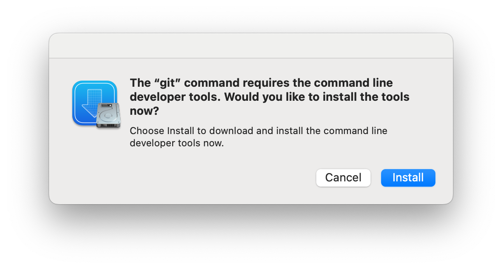
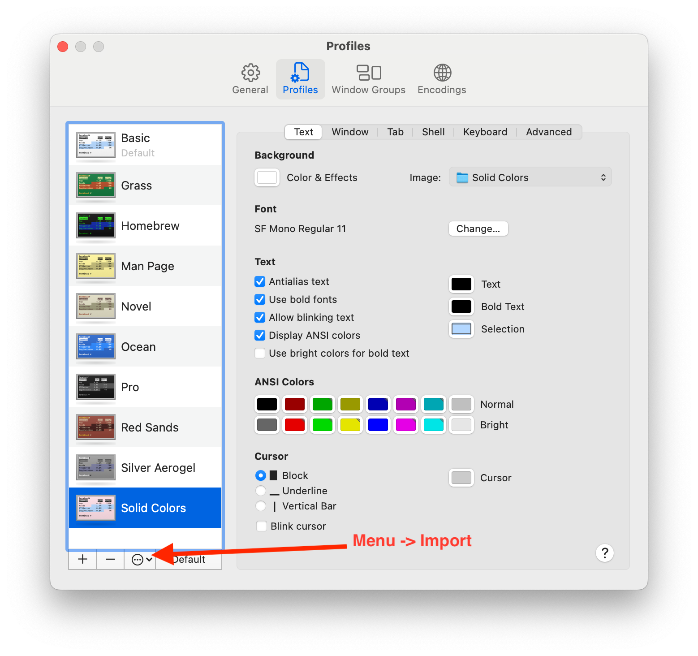
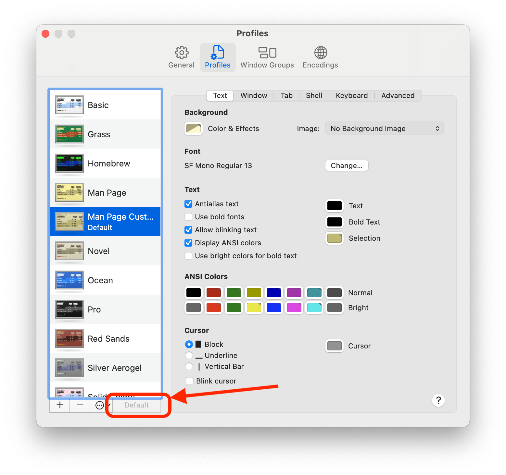
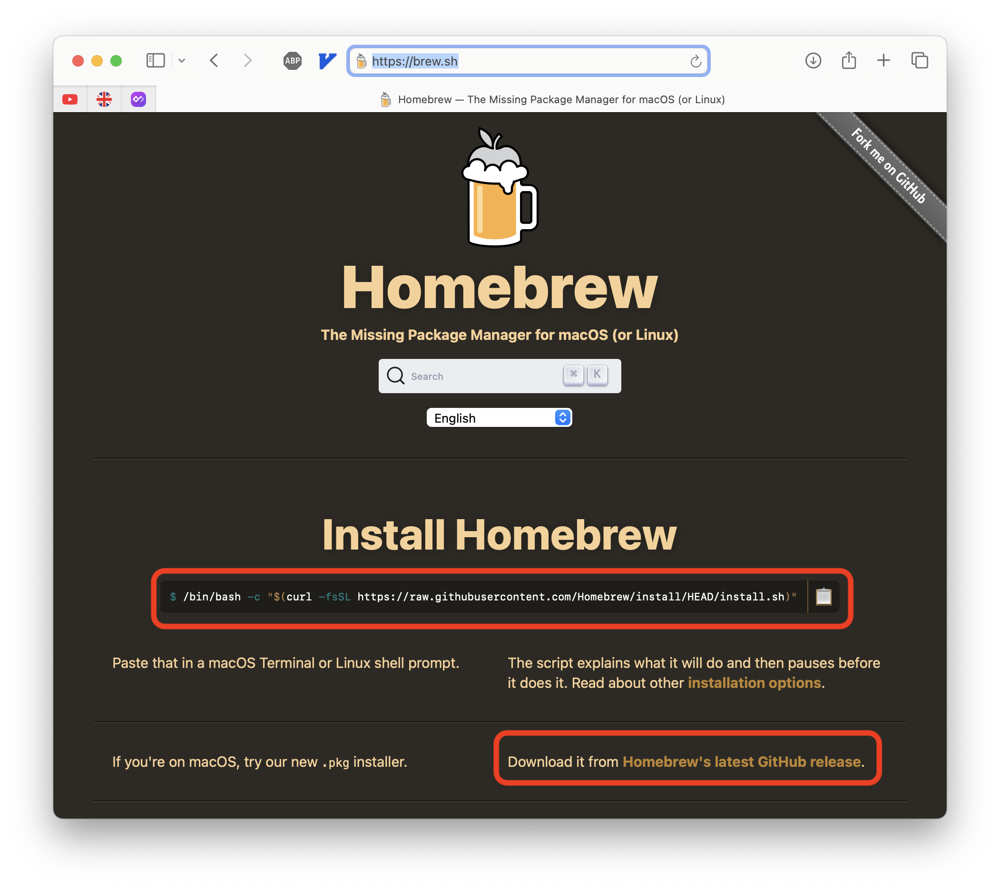
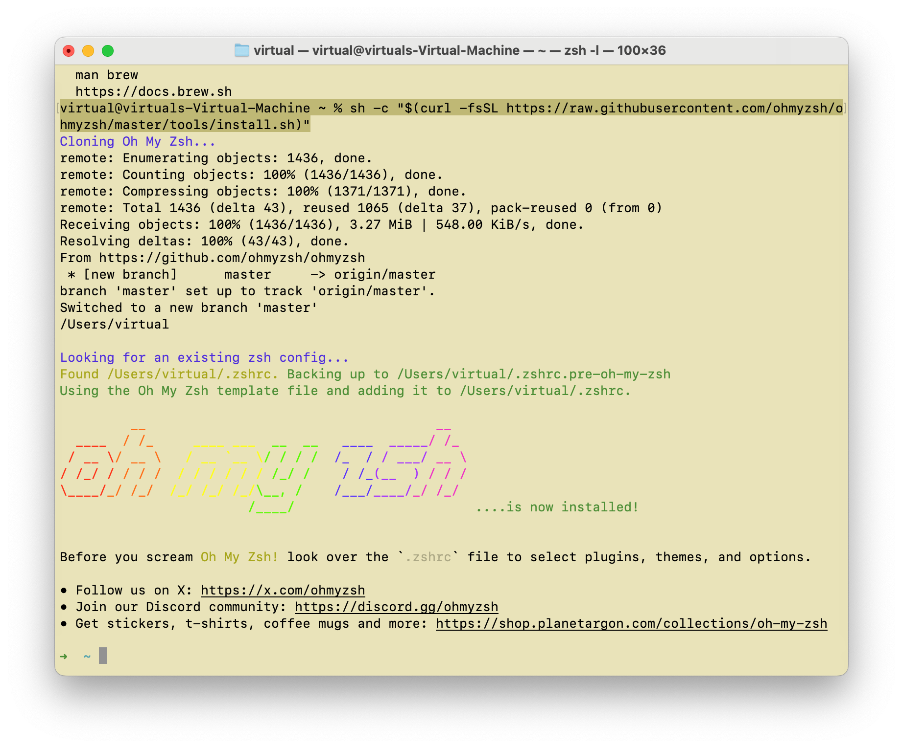
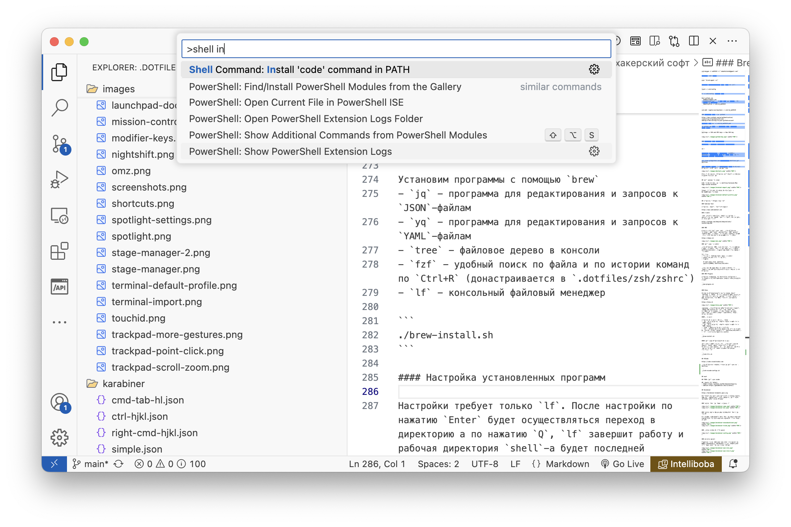
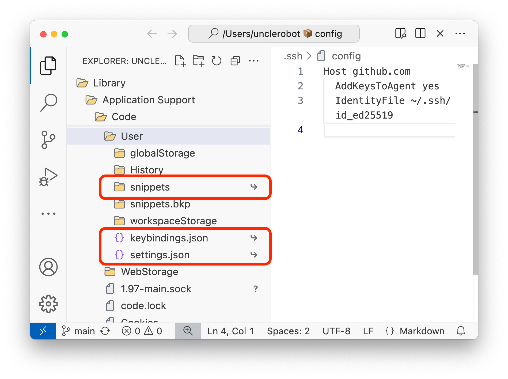
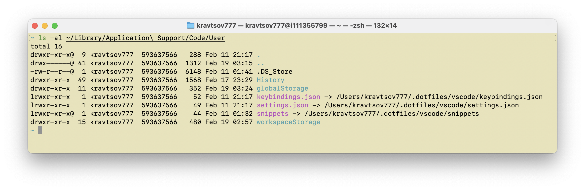
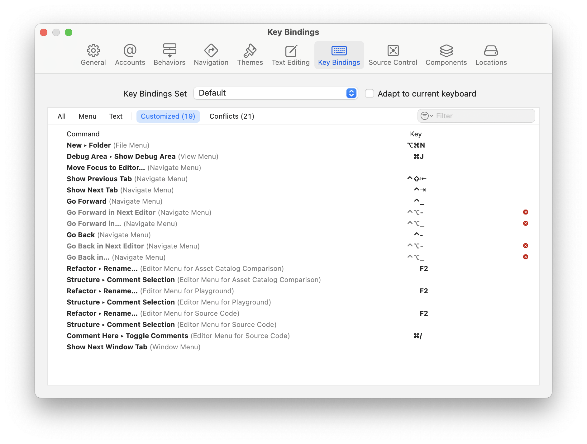

# Инструменты разработки

Клонируем этот репозиторий, устанавливаем инструменты разработки и создаём ссылки на настройки.


## Клонирование репозитория. Git

Укажем имя и почту для коммитов (либо то же самое можно настроить в IDE).

```
git config --global user.name "Aleksandr Kravtsov"
git config --global user.email "sabahtalateh@gmail.com"
```

Эти значения используются только как подпись автора в коммитах и к доступу к репозиторию (`pull`/`push`) отношения не имеют.

> При возникновении проблем с аутентификацией по SSH-ключам (например, не удаётся выполнить `pull` или `push`) обратитесь к официальной документации GitHub: https://docs.github.com/en/authentication/connecting-to-github-with-ssh


### Клонируем этот репозиторий

Переходим в домашнюю директорию пользователя.

```
cd ~
```

Клонируем репозиторий в директорию `${HOME}/.dotfiles`.

```
git clone https://github.com/sabahtalateh/dotfiles.git .dotfiles
```

Если система только что установлена будет предложено установить инструменты разработчика.



Установим их и выполним команду выше ещё раз.

Перейдём в склонированную директорию.

```
cd ~/.dotfiles
```


## Настраиваем терминал

Импортируем профиль из `~/.dotfiles/terminal/Man Page Custom.terminal`.



Делаем этот профиль профилем по умолчанию и перезапускаем терминал.



:warning: При изменении настроек профиля или добавлении нового, нужно его экспортировать в `~/.dotfiles/terminal`.


## Установим тру-хакерский софт

### Brew

Иногда не устанавливается из терминала, пишет `warning` и `fatal`. В этом случае пробуем несколько раз, если всё равно не работает то можно скачать `.pkg` установщик, эта опция тоже есть на главной странице.

https://brew.sh



:warning: После установки Homebrew предложит дописать `$PATH` в профиль — вручную этого делать не нужно, постоянно `brew` подключится ниже, на шаге [настройка `~/.zshrc`](#настройка-zshrc).

Чтобы пользоваться `brew` уже сейчас (в текущей сессии), активируем его.

```
eval "$(/opt/homebrew/bin/brew shellenv)"
```

### Программы

Установим программы.

```
brew install jq yq tree fzf lf
```

- `jq` - программа для редактирования и запросов к `JSON`-файлам (https://github.com/jqlang/jq)
- `yq` - программа для редактирования и запросов к `YAML`-файлам (https://github.com/mikefarah/yq)
- `tree` - файловое дерево в консоли (https://formulae.brew.sh/formula/tree)
- `fzf` - удобный поиск по файлам и по истории команд по `Ctrl+R` (донастраивается в `.dotfiles/zsh/zshrc`) (https://github.com/junegunn/fzf)
- `lf` - консольный файловый менеджер (https://github.com/gokcehan/lf)

### Настройка установленных программ

Настройки требует только `lf`. После настройки по нажатию `Enter` будет осуществляться переход в директорию а по нажатию `q`, `lf` завершит работу и рабочая директория `shell`-а будет последней открытой в `lf`.

Для поиска файла по имени используется кнопка `f`.

```
./link_lfrc.sh
```


## Шрифты

Ставим Nerd Fonts из Homebrew.

```
brew install --cask font-hurmit-nerd-font font-jetbrains-mono-nerd-font
```


## Настройка ZSH

### Z shell

`zsh` является дефолтным `shell`-ом начиная с какой-то версии `macOS` так что ставить его не надо, но если надо то вот.

https://github.com/ohmyzsh/ohmyzsh/wiki/Installing-ZSH


### OMZ

Фреймворк для настройки `zsh`. После установки терминал сразу станет разноцветный. `OMZ` заменит текущий файл `~/.zshrc`, и сохранит текущий в бэкап рядом, можно перенести из бэкапа всё что нужно.

https://ohmyz.sh



### OMZ Plugins

Установим 2 плагина, для подсветки синтаксиса в терминале и для подсказывания недавно использованных команд.

```
./omz_plugins.sh
```

### Настройка `~/.zshrc`

Теперь, когда плагины и программы установлены, подключим наш конфиг. Всё что нам нужно есть в файле `.dotfiles/zsh/zshrc`, добавим загрузку этого файла в `~/.zshrc`.

Для этого
- Откроем файл `~/.zshrc`
- Удалим из него всё что там есть
- Добавим
  ```
  # Load zshrc from .dotfiles
  source ${HOME}/.dotfiles/zsh/zshrc
  ```

После чего перезагрузим терминал — всё подхватится без ошибок.


## VSCode

https://code.visualstudio.com

После установки откроем `VSCode`, нажмём `Cmd+Shift+P` и выполним команду `Shell Command: Install 'code' command in PATH`. Это добавит бинарник `code` в `$PATH`, после чего из консоли можно будет открыть `VSCode` написав `code`.



:warning: Этот шаг обязателен. Без бинарника `code` в `$PATH` следующий скрипт не сможет установить расширения, так как он вызывает `code --install-extension`.

После этого создадим ссылки на настройки из `.dotfiles` и установим расширения.

```
./link_vscode_configs.sh
```

После выполнения скрипта настройки `VSCode` будут ссылками на папку `~/.dotfiles`.






## Комбинации клавиш для `XCode`




## Karabiner

https://karabiner-elements.pqrs.org

Инструмент для настройки кастомных сочетаний клавиш, например комбинации `Cmd+h/j/k/l` можно назначить на действия `Вверх/Вниз/Влево/Вправо`.

После установки запустим `Karabiner-Elements` хотя бы раз (он попросит разрешения в `System Settings → Privacy & Security → Input Monitoring` и создаст папку конфига), затем накатим настройки скриптом.

```
./link_karabiner.sh
```

Скрипт берёт правила из папки [karabiner](./karabiner) и вживляет их в текущий (выбранный) профиль `~/.config/karabiner/karabiner.json`:

- `simple.json` → простые замены (`Caps` ↔ `Esc`, значок параграфа под `Esc` → тильда; последнее нужно только на неамериканских клавиатурах)
- остальные файлы → сложные замены (`Cmd+Space`→`Cmd+Shift`, `Ctrl/RightCmd + HJKL`→стрелки, пробел как `Shift` при удержании)

Скрипт идемпотентен (можно запускать повторно), делает бэкап в `karabiner.json.bkp` и не трогает другие профили и настройки устройств. Karabiner перечитает конфиг автоматически.
