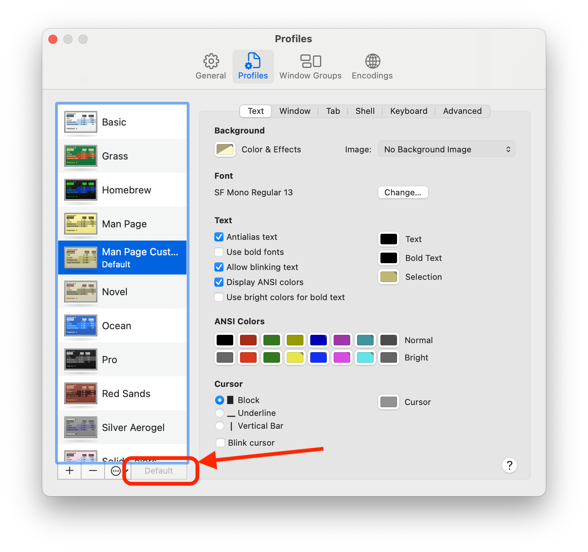
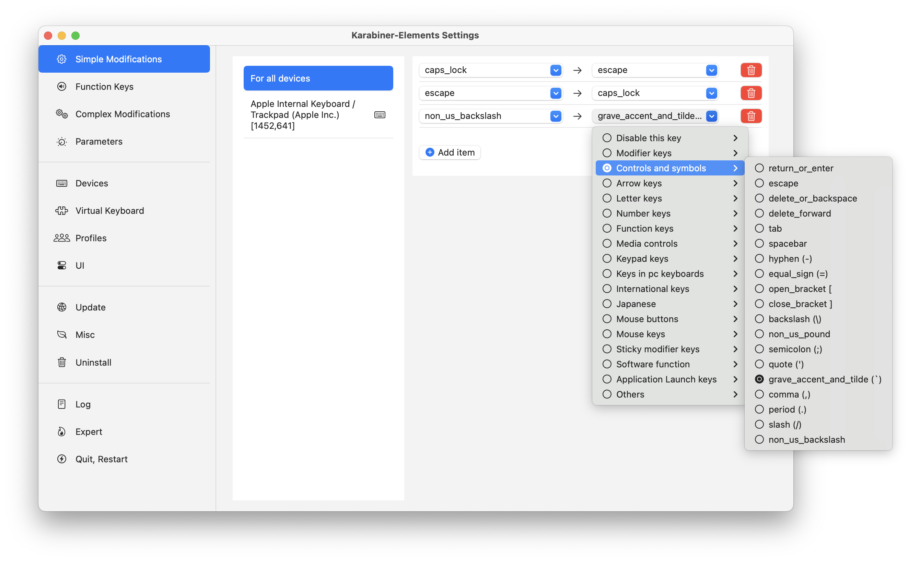
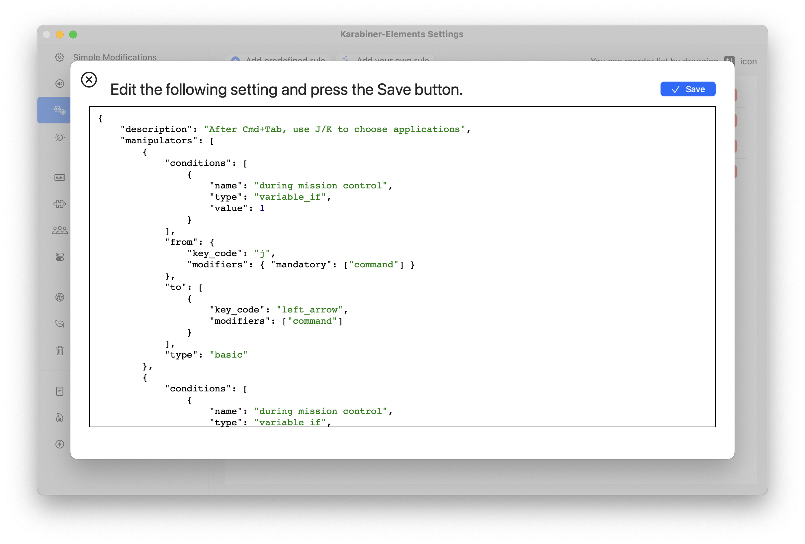

# Инструменты разработки

Клонируем этот репозиторий, устанавливаем инструменты разработки и создаём ссылки на настройки


## Клонирование репозитрия. Ssh & Git

Перед тем как делать всё что тут написано рекомендуется установить [Sublime Text](https://www.sublimetext.com) для редактирования файлов

### Генерируем `ssh`-ключ для `github`

https://docs.github.com/en/authentication/connecting-to-github-with-ssh/generating-a-new-ssh-key-and-adding-it-to-the-ssh-agent#generating-a-new-ssh-key

Генерируем ключ

```
ssh-keygen -t ed25519 -C "sabahtalateh@gmail.com"
```

Запустим `ssh`-агент

```
eval "$(ssh-agent -s)"
```

Создадим конфигурационный файл (если его нет)

```
touch ~/.ssh/config
```

В `~/.ssh/config` добавим блок

```
Host github.com
  AddKeysToAgent yes
  UseKeychain yes 		# Если ключ без пароля, эту строку на добавляем
  IdentityFile ~/.ssh/id_ed25519
```

```
ssh-add --apple-use-keychain ~/.ssh/id_ed25519
```

### Добавляем ключ в на `github`

https://docs.github.com/en/authentication/connecting-to-github-with-ssh/adding-a-new-ssh-key-to-your-github-account

Копируем ключ из `~/.ssh/id_ed25519.pub`

На github.com идём в и вставляем ключ (название пишем любое)

```
Settings -> SSH and GPG keys -> New SSH key
```


### Клонируем этот репозиторий

Переходим в домашнюю директорию пользователя

```
cd ~
```

Клонируем репозиторий в директорию `${HOME}/.dotfiles`. Клонировать нужно по этому пути, на это расчитаны скрипты репозитория

```
git clone git@github.com:sabahtalateh/dotfiles.git .dotfiles
```

Если система только что установлена будет предложено установить иснутрменты разработчика


Установим их и выполним команду выше ещё раз


## Копируем шрифты

Откроем программу `Font Book`, заходим в `~/.dotfiles/fonts` и перетаскиваем все шрифты в `Font Book`


## Настраиваем терминал

Импортируем профиль из `~/.dotfiles/terminal/Man Page Custom.terminal`


Делаем этот профиль профилем по умолчанию и перезапускаем терминал



:warning: При изменении настроек профиля или добавлении нового, нужно его экспортировать в `~/.dotfiles/terminal`


## Установим тру-хакерский софт

### Sublime Text

Установим редактор текстовых файлов

https://www.sublimetext.com

### Z shell

`zsh` является дефолтным `shell`-ом начинаю с какой-то версии `macOS` так-что ставить его не надо, но если надо то вот

https://github.com/ohmyzsh/ohmyzsh/wiki/Installing-ZSH


### OMZ

Фреймоврк для настройки `zsh`. После установки терминал сразу станет разноцветный. `OMZ` заменит текущий файл `~/.zshrc`, и сохранит текущий в бэкап рядом, можно перенести из бэкапа всё что нужно

https://ohmyz.sh


### Настройка `~/.zshrc`

После установки `OMZ` можно почитать что он написал в файл `~/.zshrc`. Всё что нам нужно есть в файле `.dotfiles/zsh/zshrc`, добавим загрузку этого файла в `~/.zshrc`

Для этого
- Откроем в `Sublime Text` файл `~/.zshrc`
- Удалим из него всё что там есть
- Добавим 
  ```
  # Load zshrc from .dotfiles
  source ${HOME}/.dotfiles/zsh/zshrc
  ```

После чего перезагрузим терминал и увидим что ругается на неустановленные программы. Сейчас мы их установим

### OMZ Plugins

Установим 2 плагина, для подсветки синтаксиса в терминале и для подсказывания недавно использованных команд

```
./omz-plugins.sh
```


### Brew

Иногда не устанавливается из терминала, пишет `warning` и `fatal`. В этом случае пробуем несколько раз, если всё равно не работает то можно скачать `.pkg` установщик, эта опция тоже есть на главной странице

https://brew.sh


:warning: После установки будет предложено добавить `$PATH`-переменные для того чтобы `brew` был доступен из терминала, это уже сделано на шаге [настройка `~/.zshrc`](#настройка-zshrc), делать ничего не нужно

#### Программы

Установим программы с помощью `brew`
- `jq` - программа для редактирования и запросов к `JSON`-файлам (https://github.com/jqlang/jq)
- `yq` - программа для редактирования и запросов к `YAML`-файлам (https://github.com/mikefarah/yq)
- `tree` - файловое дерево в консоли (https://formulae.brew.sh/formula/tree)
- `fzf` - удобный поиск по файлам и по истории команд по `Ctrl+R` (донастраивается в `.dotfiles/zsh/zshrc`) (https://github.com/junegunn/fzf)
- `lf` - консольный файловый менеджер (https://github.com/gokcehan/lf)
- `task` - запускатель программ (https://taskfile.dev)

```
./brew-install.sh
```

#### Настройка установленных программ

Настройки требует только `lf`. После настройки по нажатию `Enter` будет осуществляться переход в директорию а по нажатию `Q`, `lf` завершит работу и рабочая директория `shell`-а будет последней открытой в `lf`

```
./link-lfrc.sh
```

## VSCode

https://code.visualstudio.com

После установки откроем `VSCode` нажмём `Cmd+Shift+P` и установим `shell integrations`. После этого из консоли можно будет открыть `VSCode` написав `code`


После установки создадим ссылки на настройки из `.dotfiles`

```
./link-vscode-configs.sh
```

После выполнения скрипта настройки `VSCode` будут ссылками на папку `~/.dotfiles`


## Комбинации клавиш для `XCode`


## Karabiner

https://karabiner-elements.pqrs.org

Инструмент для настройки кастомных сочетаний клавиш, например комбинации `Cmd+h/j/k/l` можно назначить на действия `Вверх/Вниз/Влево/Вправо`


### Меняем `Esc` на `Caps` и наоборот


### Меняем значок параграфа (кнопка под `Esc`) на тильду

Это кнопка располагается под `Esc` на неамериканских клавиатурах. Для американских клавиатур этого делать не надо





### Полный конфиг простых замен


### Сложные замены

Добавляем через `Add your own rule` все замены из папки [karabiner](./karabiner) кроме `simple.json` (этот файл лежит там на всякий случай)


