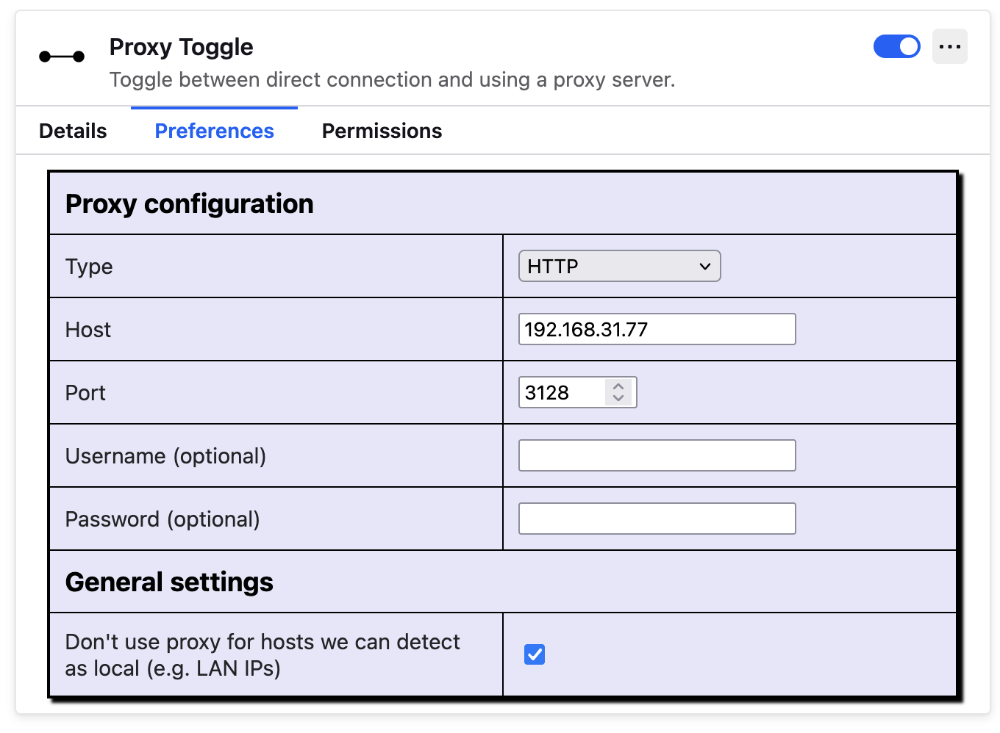

# Настраиваем прокси чтобы использовать всякие нейронки

## Машина с VPN-ом

### Устанавливаем Squid Proxy

```shell
brew install squid
```

### Настраиваем Squid Proxy

На последней `macOS` конфигурация расположена в

```
/opt/homebrew/etc/squid.conf
```

Заполняем этот файл

```
http_port 3128
acl localnet src 192.168.31.0/16  # Разрешить доступ из локальной сети
http_access allow localnet
http_access allow localhost
http_access deny all
```

`192.168.31.0` это сеть роутера (её можно узнать из системных настроек)

### Запускаем Squid Proxy

```
brew services start squid
```

Проверить что он работает можно выполнив

```
brew services list

>
squid started ak   ~/Library/LaunchAgents/homebrew.mxcl.squid.plist
```

## Машина с которой будем работать

Каким-то образом настраиваем проксирование.

Например в Firefox есть расширение `Proxy Toggle`. В нём пишем `IP` компьюетра с прокси-сервером и порт из конфигурации `Squid`-а




