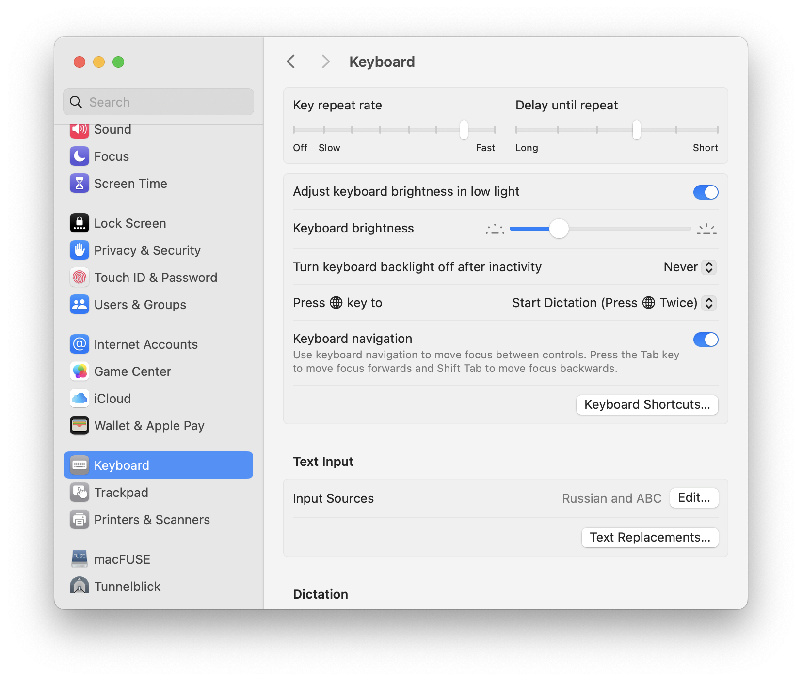
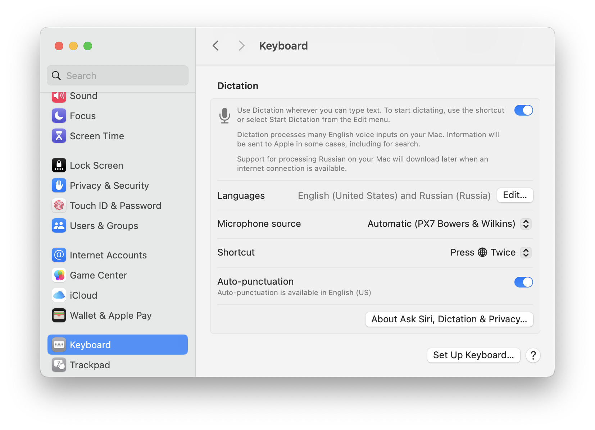

# dotfiles

<!-- Generated by https://marketplace.visualstudio.com/items?itemName=joffreykern.markdown-toc -->
<!-- Then fixed by hand -->
1. [TODO:](#TODO:)
1. [Оглавление](#оглавление)
1. [Порядок настройки](#-1)
1. [Настройка Системы](#-1)
    1. [Stage Manager](#StageManager)
    1. [Desktop & Dock](#DesktopDock)
	1. [Keyboard](#Keyboard)
	1. [Keyboard Shortcuts](#KeyboardShortcuts)
		1. [Launchpad & Dock](#LaunchpadDock)
		1. [Mission Control](#MissionControl)
		1. [Keyboard](#Keyboard-1)
		1. [Input Sources](#InputSources)
		1. [Screenshots](#Screenshots)
		1. [Spotlight](#Spotlight)
		1. [Function Keys](#FunctionKeys)
		1. [Modifier Keys](#ModifierKeys)
1. [Что надо установить и настроить руками](#-1)
	1. [Karabiner](#Karabiner)
		1. [Меняем `Esc` на `Caps` и наоборот](#EscCaps)
		1. [Меняем значок параграфа (кнопка под `Esc`) на тильду](#Esc)
		1. [Полный конфиг простых замен](#-1)
		1. [Сложные замены](#-1)
	1. [Unsplash](#Unsplash)
	1. [PastePal](#PastePal)
	1. [Hidden Bar](#HiddenBar)
	1. [Buho Cleaner](#BuhoCleaner)
	1. [Monitor Control](#MonitorControl)
	1. [Keyboard Clean Tool](#KeyboardCleanTool)
    1. [Brew](#Brew)

## TODO:
- Ролик по настройке системы с обзором настроек
- Сначала установить всё что может потребовать настройки сочетания клавиш (Только Raycast вроде)
- Karabiner
- brew (https://brew.sh)
    - zsh + ohmyzsh
    - brew install yq
    - brew install jq
    - brew install tree
    - brew install fzf
- Подумать как можно использовать `Esc` в кейбиндах, а то чо он никак нигде не используется
- Записать ролик

https://github.com/sabahtalateh/init-system

## Оглавление
- [Порядок настройки](#порядок-настройки)
- [Настройка системы](#настройка-системы)
- [Что надо установить и настроить руками](#что-надо-установить-и-настроить-руками)

## Порядок настройки

1. Сначала [настраиваем систему](#настройка-системы)
2. Потом ставим и настраиваем руками всё [что надо установить и настроить руками](#что-надо-установить-и-настроить-руками)

## Настройка Системы

### Stage Manager

Включаем в `Control Center` в верхнем меню


### Desktop & Dock

Тут просто выставляем всё как на картинках, настроек много, поэтому картинок 3


### Keyboard

Общие настройки клавиатуры. Настроек много, поэтому 2 картинки




### Keyboard Shortcuts

```
System Settings -> Keyboard -> Keyboard Shortcuts
```


#### Launchpad & Dock

Тут пофигу что настроено, но на всякий случай вот картинка


#### Mission Control

Тут нас интерисует только `Show Desktop`, эта команда убирает все окна и показывает рабочий стол


#### Keyboard

Тут нас интерисует только `Move focus to next window`, эта команда переключает окна внутри группы в режиме `Stage Manager`. Это есть мой основной способ работы


#### Input Sources

Тут настраиваем `Select the previous input source` для переключения языка


#### Screenshots

Тут ничего не менял, вроде по дефолту вот так нормально. Основная комбинация это `Shift+Cmd+5` но можно написать `screenshot` в `spotlight`-е и не запоминать такие длинные комбинации


#### Spotlight

TODO: update

Отключаем `Show Spotlight search`, вместо него будет использоваться [Raycast](#raycast)


#### Function Keys

Тут по дефолту вроде так


#### Modifier Keys

И тут по дефолту вроде так


##  Что надо установить и настроить руками

### Karabiner

https://karabiner-elements.pqrs.org

Инструмент для настройки кастомных сочетаний клавиш, например `Cmd+h/j/k/l` можно назначить на стрелки. Навигация будет более удобная


#### Меняем `Esc` на `Caps` и наоборот


#### Меняем значок параграфа (кнопка под `Esc`) на тильду

Это кнопка располагается под `Esc` на неамериканских клавиатурах. Для американских клавиатур этого делать не надо


#### Полный конфиг простых замен


#### Сложные замены

Добавляем через `Add your own rule` все замены из папки [karabiner](./karabiner) кроме `simple.json` (этот файл лежит там на всякий случай)


### Unsplash

https://apps.apple.com/ru/app/unsplash-wallpapers/id1284863847?l=en-GB&mt=12

Кросивые обои


### PastePal

https://apps.apple.com/ru/app/clipboard-manager-pastepal/id1503446680?l=en-GB

Клипборд с историей


### Hidden Bar

https://apps.apple.com/ru/app/hidden-bar/id1452453066?l=en-GB&mt=12

Прячет элементы меню когда их много


### Buho Cleaner

https://www.drbuho.com/buhocleaner/download

В бесплатной версии можно проанализировать используемое место на диске и руками удалить большие папки


### Monitor Control

https://apps.apple.com/ru/app/monitorcontrol-lite/id1595464182?l=en-GB&mt=12

Управление яркостью внешнего монитора кнопками `f1` и `f2`


### Keyboard Clean Tool

https://folivora.ai/keyboardcleantool


### Brew

https://brew.sh

Пакетный менеджер


