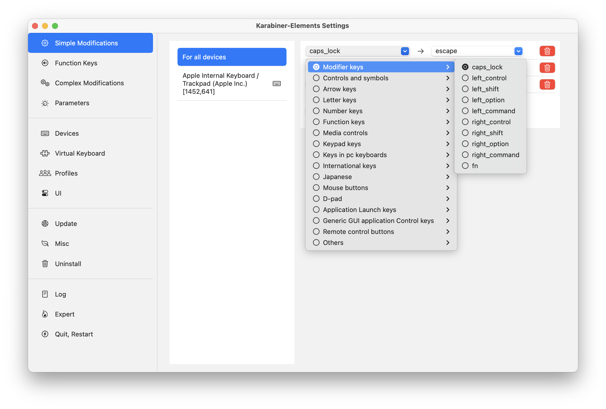

# dotfiles

## TODO:
- Записать ролик
- Karabiner
- Raycast
- use links whe possible
- brew (https://brew.sh)
- ghostty + config
- zsh + ohmyzsh
- fzf
- lf + config from .zshrc

https://github.com/sabahtalateh/init-system

## Оглавление
- [Порядок настройки](#порядок-настройки)
- [Что надо установить руками](#что-надо-установить-руками)
- [Настройки системы](#настройки-системы)
    - [Stage Manager](#stage-manager)
    - [Desktop & Dock](#desktop--dock)
    - [Keyboard shortcuts](#keyboard-shortcuts)
        - [Launchpad & Dock](#launchpad--dock)
        - [Mission Control](#mission-control)
        - [Keyboard](#keyboard)
        - [Input Sources](#input-sources)
        - [Screenshots](#screenshots)
        - [Spotlight](#spotlight)
        - [Function Keys](#function-keys)
        - [Modifier Keys](#modifier-keys)

## Порядок настройки

1. Сначала ставим руками всё [что надо установить руками](#что-надо-установить-руками)

## Что надо установить руками


### Raycast

https://www.raycast.com

Замена `Spotlight`

После установки нужно отключить хоткей для `Spotlight` в `System Settings -> Keyboard -> Keyboard Shortcuts -> Spotlight` и поставить этот хоткей на `Raycast`


### Karabiner

https://karabiner-elements.pqrs.org

Инструмент для настройки кастомных сочетаний клавиш, например `Cmd+h/j/k/l` можно назначить на стрелки. Навигация будет более удобная

После установки заменить `Esc` на `Caps` и наоборот




### Unsplash

https://apps.apple.com/ru/app/unsplash-wallpapers/id1284863847?l=en-GB&mt=12

Кросивые обои


### PastePal

https://apps.apple.com/ru/app/clipboard-manager-pastepal/id1503446680?l=en-GB

Клипборд с историей


### Hidden Bar

https://apps.apple.com/ru/app/hidden-bar/id1452453066?l=en-GB&mt=12

Прячет элементы меню когда их много


### Buho Cleaner

https://www.drbuho.com/buhocleaner/download

В бесплатной версии можно проанализировать используемое место на диске и руками удалить большие папки


### Monitor Control

https://apps.apple.com/ru/app/monitorcontrol-lite/id1595464182?l=en-GB&mt=12

Управление яркостью внешнего монитора так-же как встроенного дисплея


### Keyboard Clean Tool

https://folivora.ai/keyboardcleantool

### Ghostty

https://ghostty.org

Терминал


### Brew

Пакетный менеджер

https://brew.sh


## Настройки Системы

### Stage Manager

Включается в Control Center.


### Desktop & Dock


### Keyboard Shortcuts
Настраиваем 
```
System Settings -> Keyboard -> Keyboard Shortcuts
```

#### Launchpad & Dock


#### Mission Control


#### Keyboard

Move focus to next window переключает окна внутри группы в режиме Stage Manager. Это удобно.


#### Input Sources


#### Screenshots


#### Spotlight

Отключаем Spotlight, вместо него будет использоваться Raycast.


#### Function Keys


#### Modifier Keys


