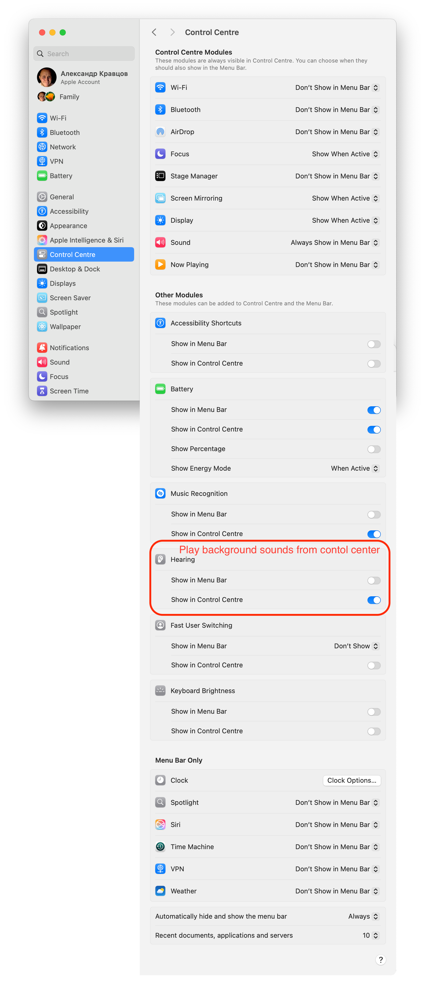
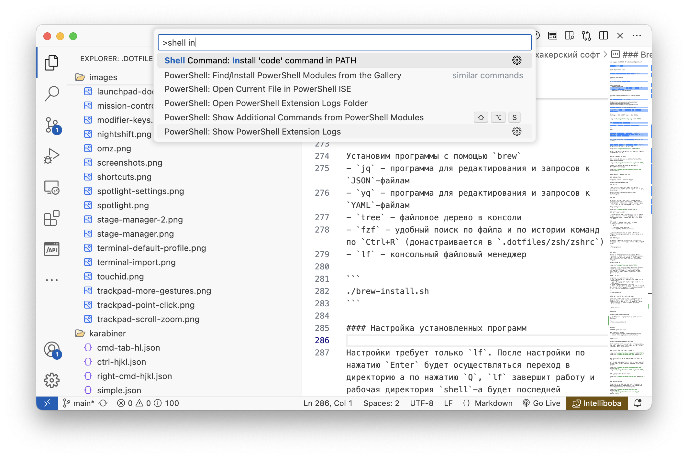
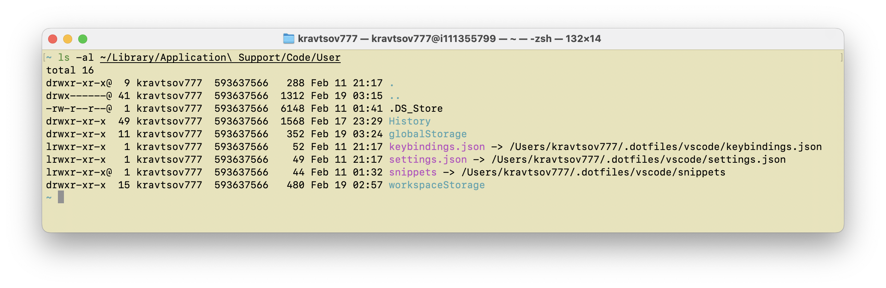

# dotfiles

Этот репозиторий содержит настройки программ и `rc`-файлы. На эти настройки создаются ссылки в систему, таким образом репозиторий содержит актуальные настройки, которые можно загружать в репозиторий

Так-же тут хранятся скриншоты системных настроек, которые надо сделать на только-что установленной системе и список программ, которые надо установить руками

## Оглавление

Пока его нет :)

## Stage Manager


После настройки сочетаний клавиш (описано ниже) можно будет переключаться между окнами одного пространства `Stage Manager`-а при помощи `Cmd+[backtick]`. Так-же ниже включим режим `Reduce Motion` чтобы окна не летали как бешеные при переключении

## System Settings

Полный обзор настроек `macOS` можно посмотреть тут https://youtu.be/d6qnXA5tDog?si=HSYtua3z8IZ6CE5c

### Acessibility


### Control Center



После включения `Hearing` в `Control Center` можно будет включать прикольные фоновые звуки


### Desktop & Dock


#### Shortcuts


#### Hot corners


### Spotlight


### Touch ID & Password


### Keyboard


Затем идём в `Keyboard Shortcuts...`

#### Launchpad & Dock


#### Display


#### Mission Control


#### Keyboard


#### Input Sources


#### Screenshots


#### Spotlight


### Wallpaper

Добавим папку `~/.dotfiles/Wallpaper` с прикольными обоями и настроим обновление. Режим заполнения выберем `Stretch to Fill Screen`


#### Accessibility


#### Function Keys


#### Modifier Keys


### Trackpad

#### Point & Click


#### Scroll & Zoom


#### More Gestures


## Finder

### General


### Sidebar


### Advanced


### Toolbar

Нажать правой кнопкой в верхней части окна `Finder` и выбрать `Customise Toolbar...`

Затем перетащить в верхнюю часть окна значки, чтобы получилось как на картинке


### Favourites

Любую папку в `Finder` можно перетащить на боковую панель в раздел `Fovourites` для быстрого доступа


### View Options

Для каждой папки можно настроить как будет отображаться содержимое в меню `View -> Show View Options`


## Клонирование репозитрия. Ssh & Git

Перед тем как делать всё что тут написано рекомендуется установить [Sublime Text](https://www.sublimetext.com) для редактирования файлов

Открываем терминал

### Генерируем `ssh`-ключ для `github`

https://docs.github.com/en/authentication/connecting-to-github-with-ssh/generating-a-new-ssh-key-and-adding-it-to-the-ssh-agent#generating-a-new-ssh-key

Генерируем ключ

```
ssh-keygen -t ed25519 -C "sabahtalateh@gmail.com"
```

Запустим `ssh`-агент

```
eval "$(ssh-agent -s)"
```

Создадим конфигурационный файл (если его нет)

```
touch ~/.ssh/config
```

В `~/.ssh/config` добавим блок

```
Host github.com
  AddKeysToAgent yes
  UseKeychain yes 		# Если ключ без пароля, эту строку на добавляем
  IdentityFile ~/.ssh/id_ed25519
```

```
ssh-add --apple-use-keychain ~/.ssh/id_ed25519
```

### Добавляем ключ в на `github`

https://docs.github.com/en/authentication/connecting-to-github-with-ssh/adding-a-new-ssh-key-to-your-github-account

Копируем ключ из `~/.ssh/id_ed25519.pub`

На github.com идём в и вставляем ключ (название пишем любое)

```
Settings -> SSH and GPG keys -> New SSH key
```


### Клонируем этот репозиторий

Переходим в домашнюю директорию пользователя

```
cd ~
```

Клонируем репозиторий в директорию `${HOME}/.dotfiles`. Клонировать нужно по этому пути, на это расчитаны скрипты репозитория

```
git clone git@github.com:sabahtalateh/dotfiles.git .dotfiles
```

Если система только что установлена будет предложено установить иснутрменты разработчика


Если это произошло, установим инструменты и выполним команду выше ещё раз


## Копируем шрифты

Откроем программу `Font Book`, заходим в `~/.dotfiles/fonts` и перетаскиваем все шрифты в `Font Book`


## Настраиваем терминал

Импортируем профиль из `~/.dotfiles/terminal/Man Page Custom.terminal`


Делаем этот профиль профилем по умолчанию и перезапускаем терминал


:warning: При изменении настроек профиля или добавлении нового, нужно его экспортировать в `~/.dotfiles/terminal`


## Установим тру-хакерский софт

### Sublime Text

Установим редактор текстовых файлов

https://www.sublimetext.com

### Z shell

`zsh` является дефолтным `shell`-ом начинаю с какой-то версии `macOS` так-что ставить его не надо, но если надо то вот

https://github.com/ohmyzsh/ohmyzsh/wiki/Installing-ZSH


### OMZ

Фреймоврк для настройки `zsh`. После установки терминал сразу станет разноцветный. `OMZ` заменит текущий файл `~/.zshrc`, и сохранит текущий в бэкап рядом, можно перенести из бэкапа всё что нужно

https://ohmyz.sh


### Настройка `~/.zshrc`

После установки `OMZ` можно почитать что он написал в файл `~/.zshrc`. Всё что нам нужно есть в файле `.dotfiles/zsh/zshrc`, добавим загрузку этого файла в `~/.zshrc`

Для этого
- Откроем в `Sublime Text` файл `~/.zshrc`
- Удалим из него всё что там есть
- Добавим 
  ```
  # Load zshrc from .dotfiles
  source ${HOME}/.dotfiles/zsh/zshrc
  ```

После чего перезагрузим терминал и увидим что ругается на неустановленные программы. Сейчас мы их установим

### OMZ Plugins

Установим 2 плагина, для подсветки синтаксиса в терминале и для подсказывания недавно использованных команд

```
./omz-plugins.sh
```


### Brew

Иногда не устанавливается из терминала, пишет `warning` и `fatal`. В этом случае пробуем несколько раз, если всё равно не работает то можно скачать `.pkg` установщик, эта опция тоже есть на главной странице

https://brew.sh


:warning: После установки будет предложено добавить `$PATH`-переменные для того чтобы `brew` был доступен из терминала, это уже сделано на шаге [настройка `~/.zshrc`](#настройка-zshrc), делать ничего не нужно

#### Программы

Установим программы с помощью `brew`
- `jq` - программа для редактирования и запросов к `JSON`-файлам
- `yq` - программа для редактирования и запросов к `YAML`-файлам
- `tree` - файловое дерево в консоли
- `fzf` - удобный поиск по файлам и по истории команд по `Ctrl+R` (донастраивается в `.dotfiles/zsh/zshrc`)
- `lf` - консольный файловый менеджер

```
./brew-install.sh
```

#### Настройка установленных программ

Настройки требует только `lf`. После настройки по нажатию `Enter` будет осуществляться переход в директорию а по нажатию `Q`, `lf` завершит работу и рабочая директория `shell`-а будет последней открытой в `lf`

```
./link-lfrc.sh
```

## VSCode

https://code.visualstudio.com

После установки откроем `VSCode` нажмём `Cmd+Shift+P` и установим `shell integrations`. После этого из консоли можно будет открыть `VSCode` написав `code`



После установки создадим ссылки на настройки из `.dotfiles`

```
./link-vscode-configs.sh
```

После выполнения скрипта настройки `VSCode` будут ссылками на папку `~/.dotfiles`





## Комбинации клавиш для `XCode`


## Karabiner

https://karabiner-elements.pqrs.org

Инструмент для настройки кастомных сочетаний клавиш, например комбинации `Cmd+h/j/k/l` можно назначить на действия `Вверх/Вниз/Влево/Вправо`


### Меняем `Esc` на `Caps` и наоборот


### Меняем значок параграфа (кнопка под `Esc`) на тильду

Это кнопка располагается под `Esc` на неамериканских клавиатурах. Для американских клавиатур этого делать не надо


### Полный конфиг простых замен


### Сложные замены

Добавляем через `Add your own rule` все замены из папки [karabiner](./karabiner) кроме `simple.json` (этот файл лежит там на всякий случай)


## Hidden Bar

https://apps.apple.com/ru/app/hidden-bar/id1452453066

Прячет элементы меню когда их много


## Monitor Control

https://apps.apple.com/ru/app/monitorcontrol-lite/id1595464182

Управление яркостью внешнего монитора


## PastePal

https://apps.apple.com/ru/app/clipboard-manager-pastepal/id1503446680

Клипборд с историей


## Buho Cleaner

https://www.drbuho.com/buhocleaner/download

В бесплатной версии можно проанализировать используемое место на диске и руками удалить большие файлы и папки


## Keyboard Clean Tool

https://folivora.ai/keyboardcleantool


## Unsplash

https://apps.apple.com/ru/app/unsplash-wallpapers/id1284863847

Кросивые обои

## Плагины для Safari
- Vimari https://github.com/MarcDonald/Vimarily
- Adblock https://apps.apple.com/ru/app/adblock-plus-for-safari-abp/id1432731683
