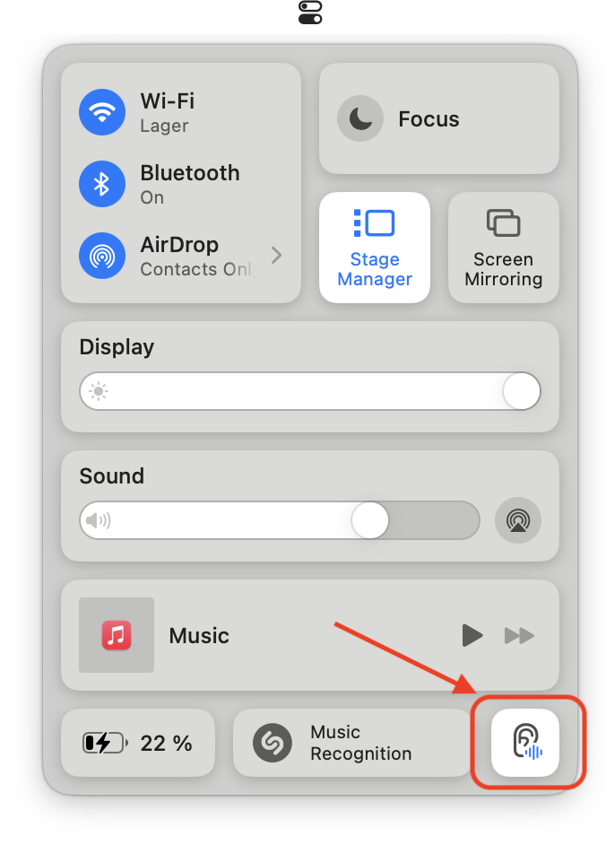
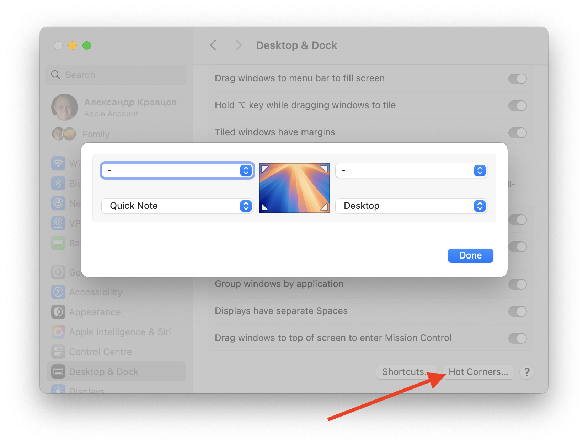
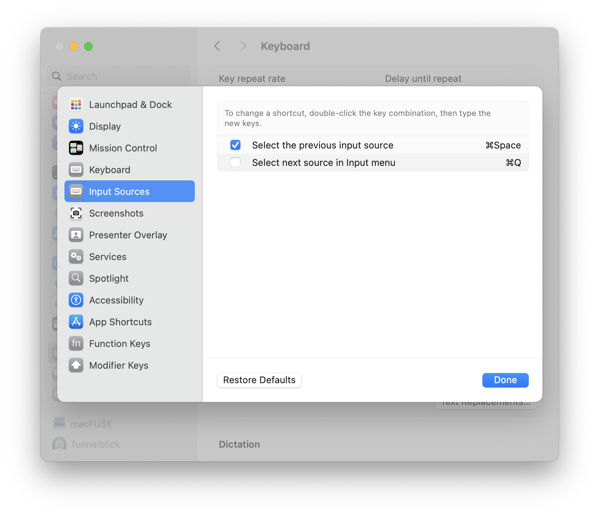
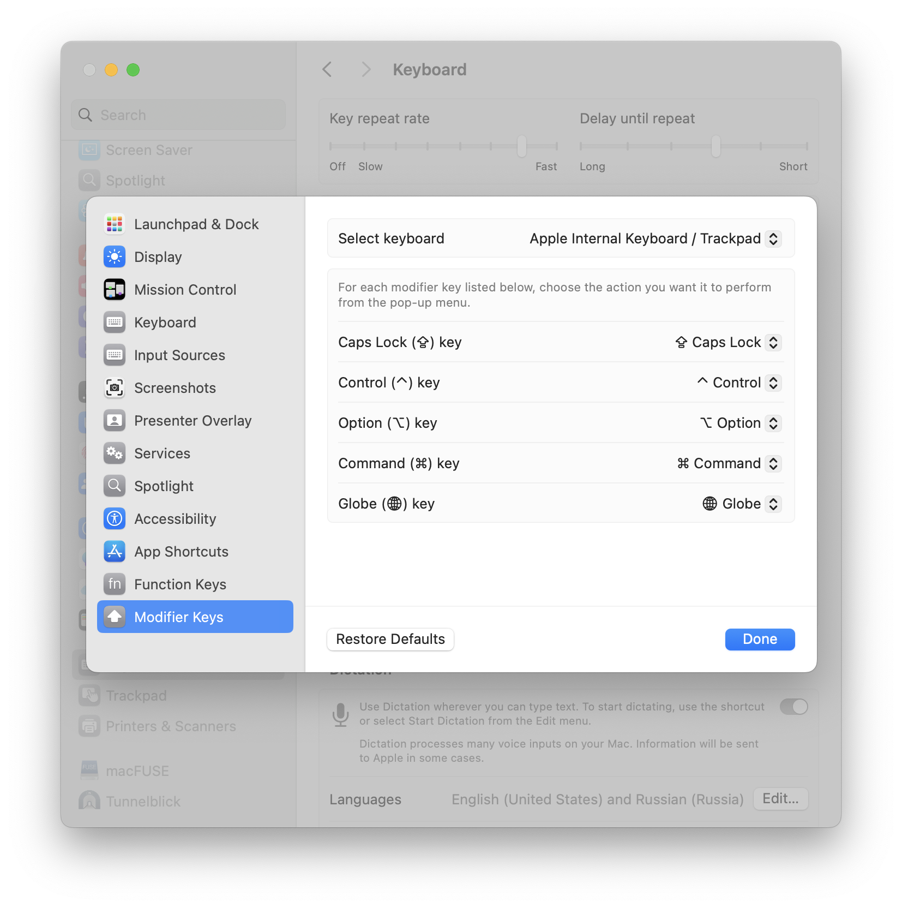
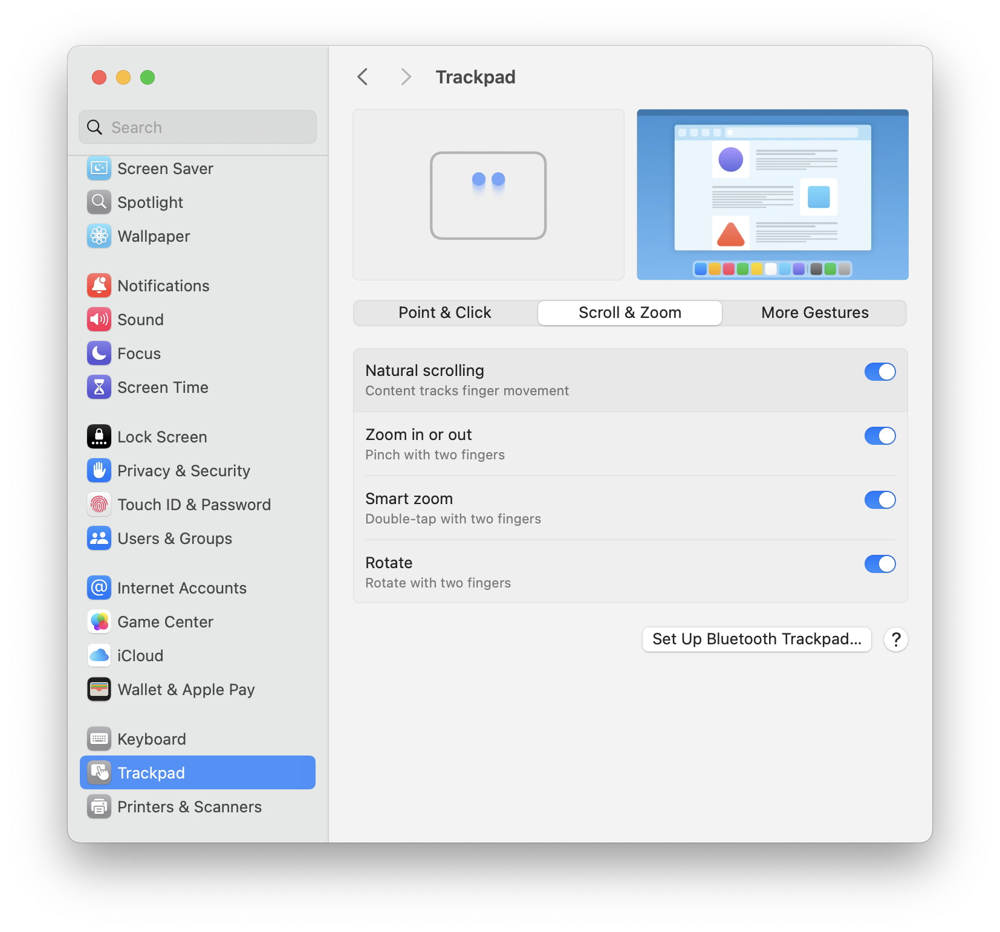
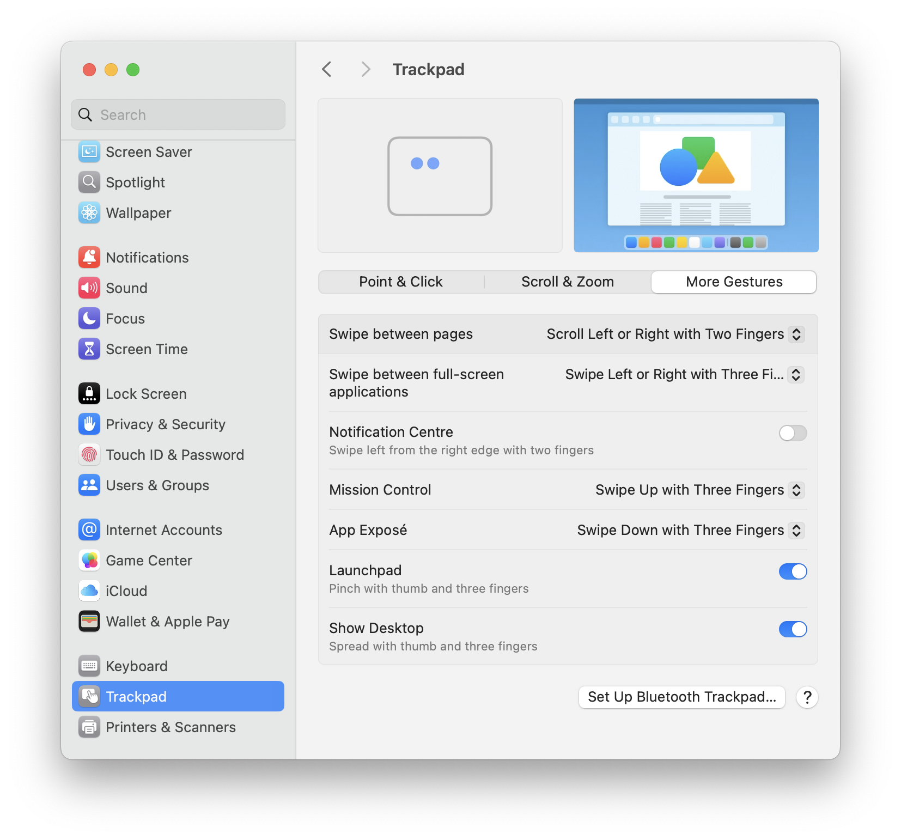
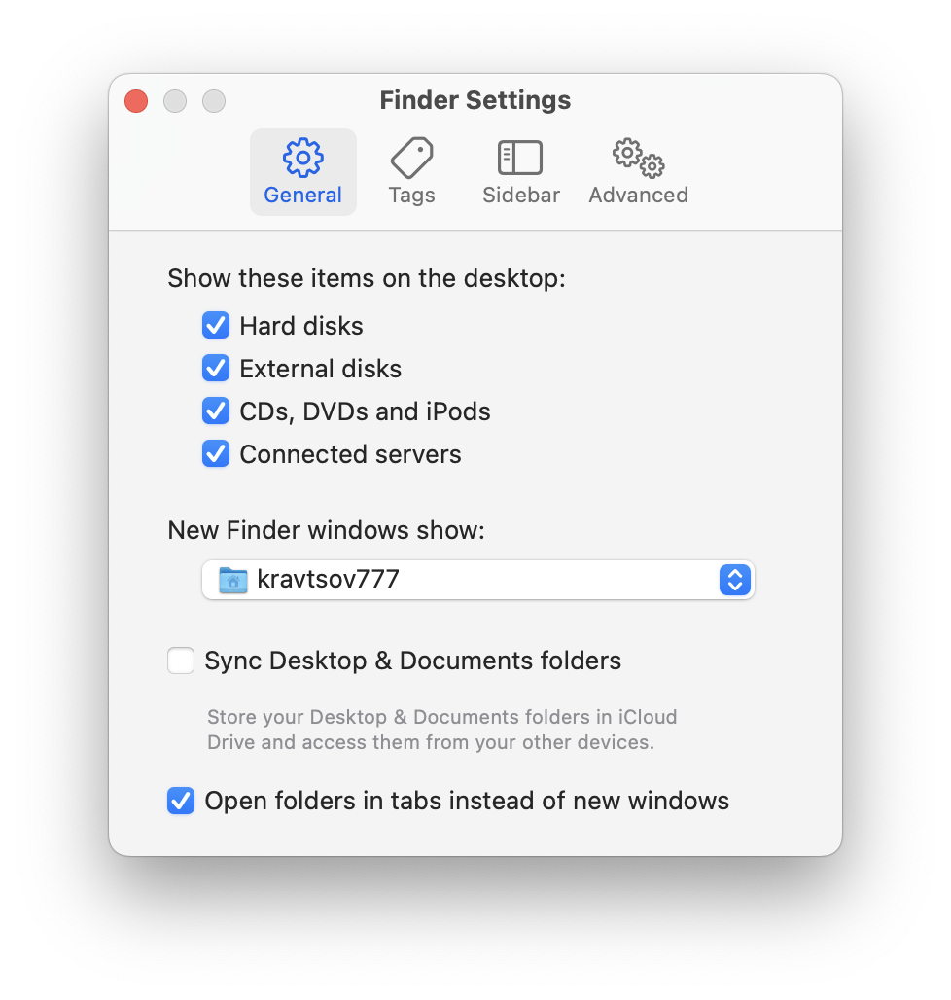
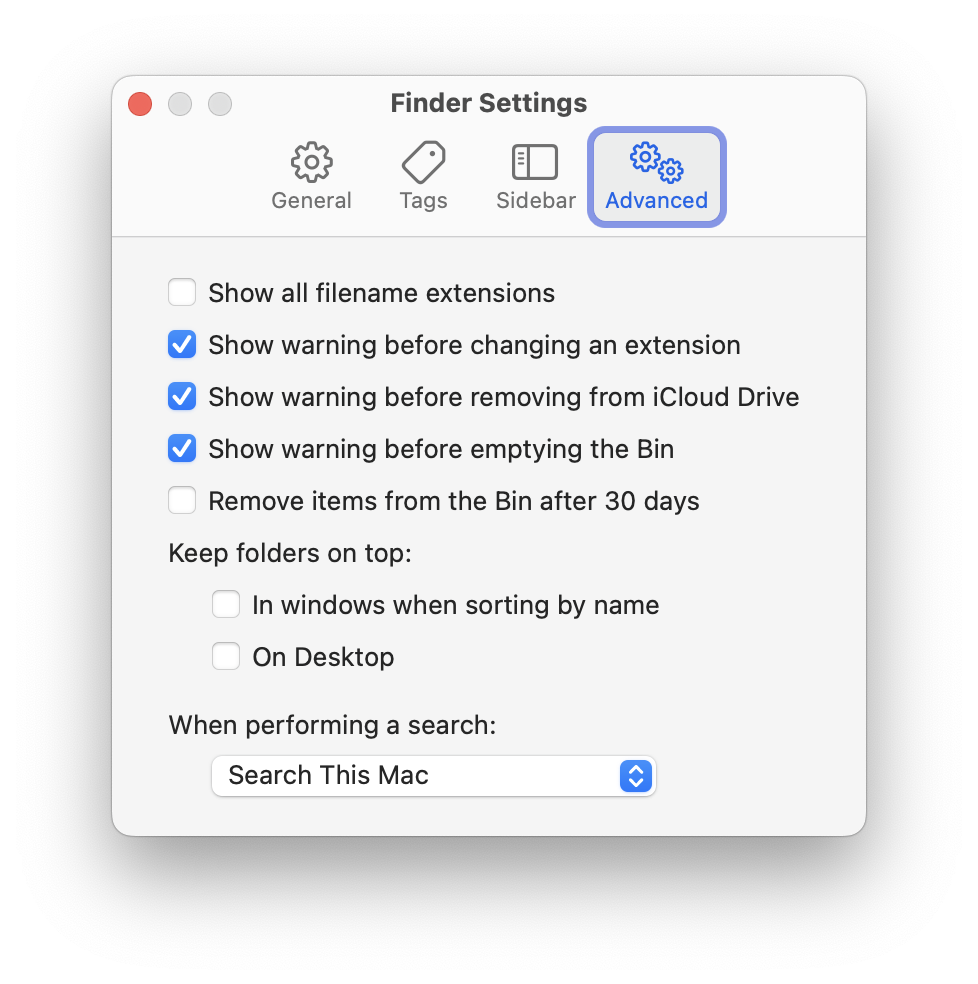
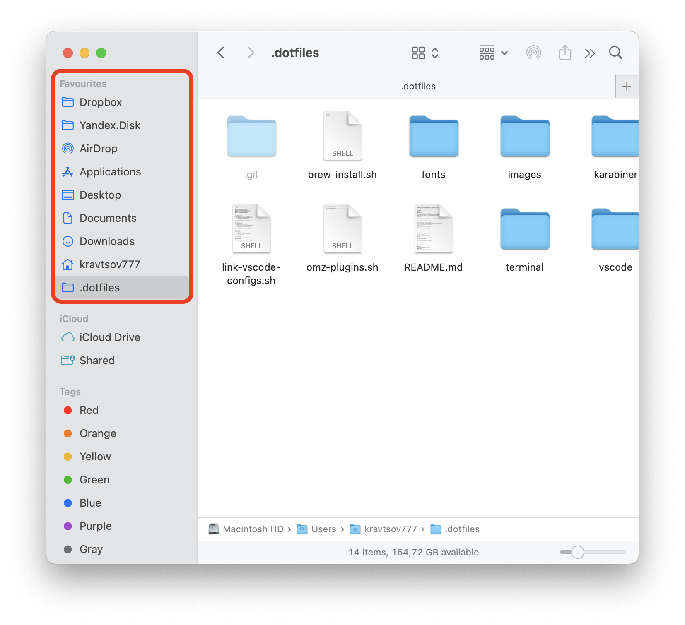
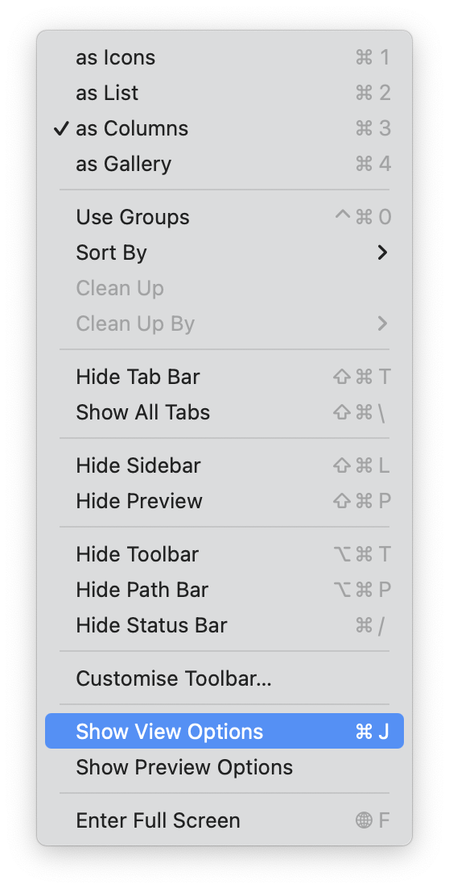

# Настройки системы `macOS`

Настраиваем систему

## Stage Manager

После настройки сочетания клавиш [Move focus to next window](#keyboard-1) можно будет переключаться между окнами одного пространства `Stage Manager`-а при помощи `Cmd+[backtick]`. Так-же ниже [включим Reduce Motion](#acessibility) чтобы окна не летали как бешеные при переключении

## System Settings

Полный обзор настроек `macOS` можно посмотреть тут https://youtu.be/d6qnXA5tDog?si=HSYtua3z8IZ6CE5c

### Acessibility

### Control Center

После включения `Hearing` в `Control Center` можно будет включать прикольные фоновые звуки

### Desktop & Dock

#### Shortcuts

#### Hot corners

### Spotlight

### Touch ID & Password

### Keyboard

Затем идём в `Keyboard Shortcuts...`

#### Launchpad & Dock

#### Display

#### Mission Control

#### Keyboard

#### Input Sources

#### Screenshots

#### Spotlight

#### Wallpaper

Добавим папку `~/.dotfiles/Wallpaper` с прикольными обоями и настроим обновление. Режим заполнения выберем `Stretch to Fill Screen`

#### Accessibility

#### Function Keys

#### Modifier Keys

### Trackpad

#### Point & Click

#### Scroll & Zoom

#### More Gestures

## Finder

Чтобы показать скрытые файлы надо нажать `Cmd+Shift+.`

### General

### Sidebar

### Advanced

### Toolbar

Нажать правой кнопкой в верхней части окна `Finder` и выбрать `Customise Toolbar...`

Затем перетащить в верхнюю часть окна значки, чтобы получилось как на картинке

### Favourites

Любую папку в `Finder` можно перетащить на боковую панель в раздел `Fovourites` для быстрого доступа

### View Options

Для каждой папки можно настроить как будет отображаться содержимое в меню `View -> Show View Options`

