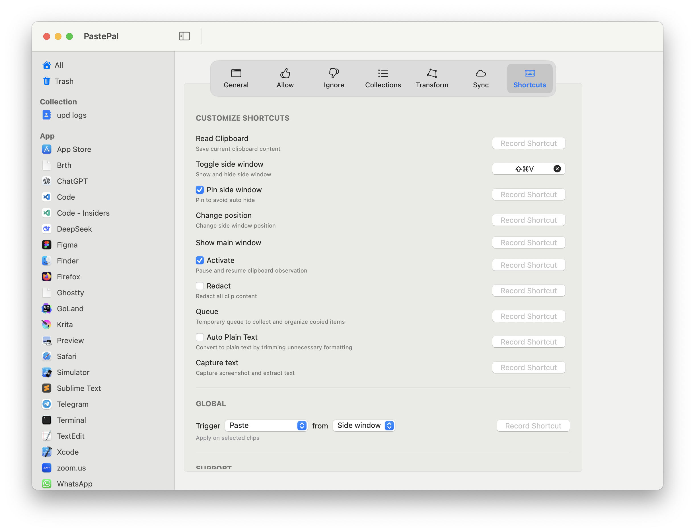

# Полезные утилитки

На разработку это не влияет, просто полезные программки

## Hidden Bar

https://apps.apple.com/ru/app/hidden-bar/id1452453066

Прячет элементы меню когда их много. Элементы меню перетаскиваются с зажатым `Cmd`

## Monitor Control

https://apps.apple.com/ru/app/monitorcontrol-lite/id1595464182

Управление яркостью внешнего монитора

## PastePal

https://apps.apple.com/ru/app/clipboard-manager-pastepal/id1503446680

Клипборд с историей (куплена платная версия)

Настроим его

## Buho Cleaner

https://www.drbuho.com/buhocleaner/download

В бесплатной версии можно проанализировать используемое место на диске и руками удалить большие файлы и папки

## Keyboard Clean Tool

https://folivora.ai/keyboardcleantool

## Плагины для Safari
- Vimari https://github.com/MarcDonald/Vimarily
- Adblock https://apps.apple.com/ru/app/adblock-plus-for-safari-abp/id1432731683

## Прикольные штуки

### Кросивые обои

Тут можно скачивать кросивые обои и складывать в `~/.dotfiles/Wallpapers`

https://unsplash.com/wallpapers
