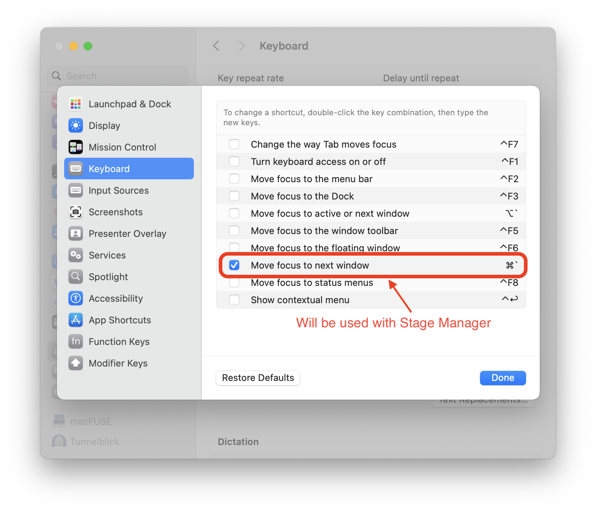
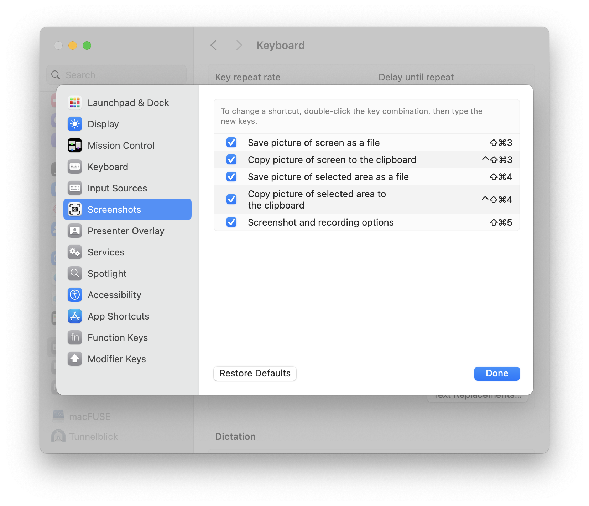

1. [Stage Manager](#stage-manager)
1. [Desktop & Dock](#DesktopDock)
1. [Keyboard](#Keyboard)
1. [Keyboard Shortcuts](#KeyboardShortcuts)
    1. [Launchpad & Dock](#LaunchpadDock)
    1. [Mission Control](#MissionControl)
    1. [Keyboard](#Keyboard-1)
    1. [Input Sources](#InputSources)
    1. [Screenshots](#Screenshots)
    1. [Spotlight](#Spotlight)
    1. [Function Keys](#FunctionKeys)
    1. [Modifier Keys](#ModifierKeys)

### Stage Manager

Включаем в `Control Center` в верхнем меню


### Desktop & Dock

Тут просто выставляем всё как на картинках, настроек много, поэтому картинок 3


### Keyboard

Общие настройки клавиатуры. Настроек много, поэтому 2 картинки


### Keyboard Shortcuts

```
System Settings -> Keyboard -> Keyboard Shortcuts
```


#### Launchpad & Dock

Тут пофигу что настроено, но на всякий случай вот картинка


#### Mission Control

Тут нас интерисует только `Show Desktop`, эта команда убирает все окна и показывает рабочий стол


#### Keyboard

Тут нас интерисует только `Move focus to next window`, эта команда переключает окна внутри группы в режиме `Stage Manager`. Это есть мой основной способ работы




#### Input Sources

Тут настраиваем `Select the previous input source` для переключения языка


#### Screenshots

Тут ничего не менял, вроде по дефолту вот так нормально. Основная комбинация это `Shift+Cmd+5` но можно написать `screenshot` в `spotlight`-е и не запоминать такие длинные комбинации




#### Spotlight

TODO: update

Отключаем `Show Spotlight search`, вместо него будет использоваться [Raycast](#raycast)


#### Function Keys

Тут по дефолту вроде так


#### Modifier Keys

И тут по дефолту вроде так

